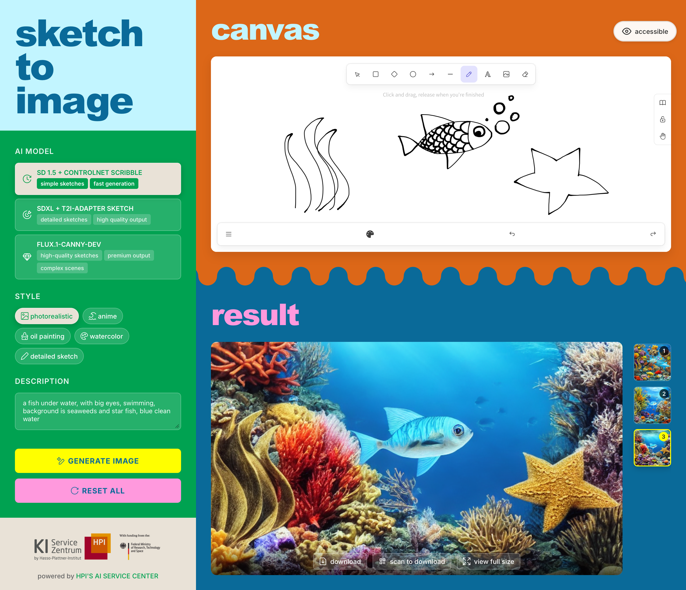
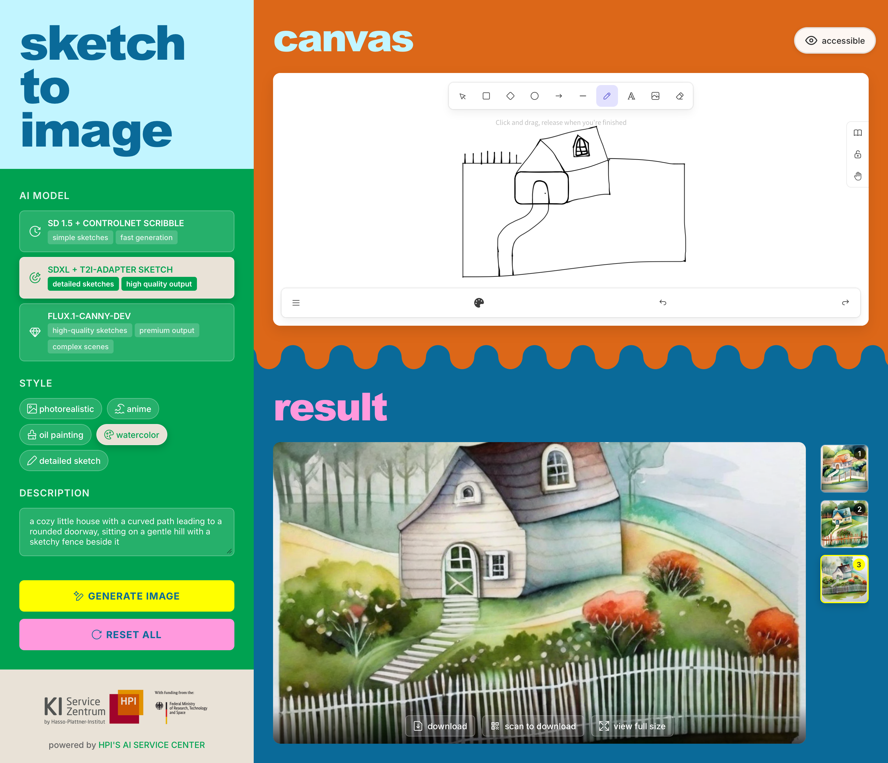

# Sketch-to-Image Demonstrator

<div style="background-color: #ffffff; color: #000000; padding: 10px;">

</div>

This project is an interactive tool that transforms simple sketches into detailed images using AI models. Users can draw freehand sketches and convert them into realistic or artistic images in various styles.



## Features

- **Interactive Drawing**: Built with Excalidraw for a natural drawing experience
- **Multiple AI Models**: Choose between three different AI models, each with unique capabilities and inference speeds
- **Multiple Styles**: Choose from multiple visual styles for your generated images (Photorealistic, Anime, Oil Painting, Watercolor, and Detailed Sketch)
- **Real-time Progress Visualization**: Watch the generation process from noisy intermediate images to final results
- **Multiple Results**: Each model generates 3 different variations simultaneously, allowing you to choose the best output
- **Responsive Design**: Works on tablets and desktop devices
- **GPU Acceleration**: Utilizes NVIDIA GPUs when available for faster image generation

## How It Works

<table>
  <tr>
    <td width="50%" align="center">
      
      <br>
      <b>Final Result</b>
      <br>
    </td>
    <td width="50%" align="center">
      
      <br>
      <b>Generation Process</b>
      <br>
    </td>
  </tr>
</table>

## Setup and Installation

### Prerequisites

Choose one of the following setup methods based on your preference:

**Option 1: Docker Setup**
- Docker and Docker Compose
- NVIDIA GPU with CUDA support
- NVIDIA Container Toolkit

**Option 2: Conda Setup (Recommended for development)**
- Miniconda or Anaconda
- NVIDIA GPU with CUDA support
- CUDA Toolkit 11.8 (if using GPU)

### Quick Start - Docker

1. Clone the repository:
```bash
   git clone https://github.com/aihpi/sketch2image.git
   cd sketch2image
```

2. Run the Docker setup script:
```bash
   chmod +x scripts/setup/setup_docker.sh
   ./scripts/setup/setup_docker.sh
```

3. Start the application:
```bash
   chmod +x scripts/run/start_docker.sh
   ./scripts/run/start_docker.sh
```

4. Access the application:
   - Frontend: http://localhost:3000
   - The backend API runs internally and is not directly exposed

### Quick Start - Conda

1. Clone the repository:
```bash
   git clone https://github.com/aihpi/sketch2image.git
   cd sketch2image
```

2. Run the Conda setup script:
```bash
   chmod +x scripts/setup/setup_conda.sh
   ./scripts/setup/setup_conda.sh
```
   
   This will create two conda environments:
   - `sketch2image-backend`: Python 3.10 with PyTorch and AI libraries
   - `sketch2image-frontend`: Node.js with React dependencies

3. Start the application:
```bash
   chmod +x scripts/run/start_conda.sh
   ./scripts/run/start_conda.sh
```

4. Access the application:
   - Application: http://localhost:3000

**For Development Mode with Hot Reload:**
```bash
chmod +x scripts/run/start_dev.sh
./scripts/run/start_dev.sh
```

## User Guide

### Using the Sketch-to-Image Tool

1. **Draw your sketch** on the Excalidraw canvas
   - Keep lines clear and distinct for best results
   - Simple sketches work better than highly detailed ones

2. **Select an AI model**:
   - **SD 1.5 + ControlNet Scribble**: Fastest generation (~2-3s on GPU, generates 3 variations)
   - **SDXL + T2I-Adapter Sketch**: Balanced quality and speed (~8-10s on GPU, generates 3 variations)
   - **FLUX.1-Canny-dev**: Premium quality, slowest (~35-60s on GPU, generates 1 image)
   
   **Note**: Each model is trained on different datasets and may perform differently depending on the subject. Try different models for the same sketch to find the best results.
   
3. **Choose an output style**:
   - **Photorealistic**: Realistic images with photographic details
   - **Anime**: Cartoon/anime style with simplified shapes and bold colors
   - **Oil Painting**: Artistic oil painting look with rich textures
   - **Watercolor**: Soft watercolor art style with gentle color blending
   - **Detailed Sketch**: Enhanced detailed sketch with improved linework and shading

4. **Add a description**
   - Describe what you're drawing for better results
   - Example: "a cat sitting on a windowsill"
   - Include key details you want emphasized

5. **Click "Generate Image"**
   - Watch the real-time generation process as the image evolves from noise to the final result
   - Select your favorite result from the 3 variations

6. **Managing Results**:
   - Choose between the 3 generated variations by clicking on the thumbnails
   - Download your favorite image using the download button
   - Use the "Reset All" button to start over with a new sketch

### Recommended Workflow

For best results:
1. Start with a simple sketch with clear outlines
2. Try all three models to see which captures your vision best
3. Experiment with different styles
4. Use specific descriptions that emphasize important elements
5. If results aren't satisfactory, try a different model - each model has different strengths and training data

**Important**: Since each generation creates 3 random variations, quality may vary between results. Review all 3 outputs and select the best one for your needs.

## Example Results

The following examples showcase how the system transforms simple sketches into various styles:


<!--  -->


## Limitations

- **Sketch Clarity**: The system works best with clear, simple line drawings; complex or ambiguous sketches may produce unexpected results.
- **Generation Time**: Processing time varies based on your hardware capabilities and the selected AI model (ControlNet is fastest, FLUX is slowest but highest quality).
- **Style Consistency**: Some styles work better with certain subjects than others. For example, the "anime" style may not always produce consistent anime-style artwork for all sketches.
- **Unusual Subjects**: The models may struggle with abstract or highly unusual sketches that don't resemble subjects in their training data.
- **Model-Subject Compatibility**: Each model is trained on different datasets and may perform better or worse on specific subjects. If results are unsatisfactory, the model may not have been exposed to similar subjects during training - try a different model.
- **Resolution**: Output images are fixed at 512×512 pixels for ControlNet and T2I-Adapter models, and 1024×1024 pixels for FLUX.
- **Model Limitations**: 
     - All models occasionally ignore certain elements in very complex sketches.
     - All models sometimes misinterpret the scale or perspective of sketched objects.
     - Results vary between the 3 generated variations due to the randomness in the generation process.

## Advanced Configuration

You can modify the application settings by editing the `.env` file (created during setup):

- `MODEL_ID`: The default model to use
- `NUM_INFERENCE_STEPS`: Number of diffusion steps
- `GUIDANCE_SCALE`: Controls how closely the output follows the prompt
- `OUTPUT_IMAGE_SIZE`: Size of the generated image
- `DEVICE`: Set to "cuda" for GPU or "cpu" for CPU processing

## Troubleshooting

- **Slow Generation**: Try using the ControlNet Scribble model instead of T2I-Adapter or FLUX
- **Poor Results**: Simplify your sketch and provide a clear description, or try a different model
- **Container Errors (Docker)**: Check Docker logs with `docker-compose logs`
- **Environment Errors (Conda)**: Ensure both conda environments are activated correctly
- **GPU Not Detected**: Ensure NVIDIA drivers and CUDA/Docker GPU support are correctly installed

## Acknowledgements

- [Excalidraw](https://excalidraw.com/) for the drawing interface
- [Hugging Face](https://huggingface.co/) for hosting the pre-trained models
- [ControlNet](https://github.com/lllyasviel/ControlNet), [T2I-Adapter](https://github.com/TencentARC/T2I-Adapter) & [FLUX](https://github.com/black-forest-labs/flux) for the sketch-to-image technology

---
The [KI-Servicezentrum Berlin-Brandenburg](http://hpi.de/kisz), which created this tool, was funded by the Federal Ministry of Research, Technology and Space under the funding code 16IS22092.