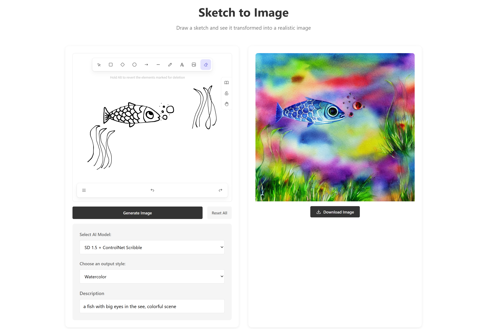

# Sketch-to-Image Demonstrator

This project is an interactive tool that transforms simple sketches into detailed images using AI models. Users can draw freehand sketches and convert them into realistic or artistic images in various styles.



## Features

- **Interactive Drawing**: Built with Excalidraw for a natural drawing experience
- **Model Selection**: Choose between two different AI models with different capabilities
- **Multiple Styles**: Choose from multiple visual styles for your generated images (Photorealistic, Anime, Oil Painting, Watercolor, and Detailed Sketch)
- **Responsive Design**: Works on tablets and desktop devices
- **GPU Acceleration**: Utilizes NVIDIA GPUs when available for faster image generation

## Setup and Installation

### Prerequisites

- Docker and Docker Compose
- NVIDIA GPU with CUDA support (optional, but recommended for faster performance)

### Quick Start

1. Clone the repository:
   ```bash
   git clone https://github.com/aihpi/sketch2image.git
   cd sketch2image
   ```

2. Run the setup script:
   ```bash
   chmod +x setup.sh
   ./setup.sh
   ```

3. Access the application:
   - Frontend: http://localhost:3000
   - Backend API: http://localhost:8000/api

## User Guide

### Using the Sketch-to-Image Tool

1. **Draw your sketch** on the Excalidraw canvas
   - Keep lines clear and distinct for best results
   - Simple sketches work better than highly detailed ones

2. **Select an AI model**:
   - **SD 1.5 + ControlNet Scribble**: Faster generation (5-15s on GPU)
   - **SDXL + T2I-Adapter Sketch**: Higher quality but slower (10-30s on GPU)

3. **Choose an output style**:
   - **Photorealistic**: Realistic images with photographic details
   - **Anime**: Cartoon/anime style with simplified shapes and bold colors
   - **Oil Painting**: Artistic oil painting look with rich textures
   - **Watercolor**: Soft watercolor art style with gentle color blending
   - **Detailed Sketch**: Enhanced detailed sketch with improved linework and shading

4. **Add a description**
   - Describe what you're drawing for better results
   - Example: "a cat sitting on a windowsill"
   - Include key details you want emphasized

5. **Click "Generate Image"**
   - Wait for the AI to process your sketch (5-30 seconds)
   - The generated image will appear on the right side

4. **Managing Results**:
   - Download your image using the download button
   - Use the "Reset All" button to start over with a new sketch

### Recommended Workflow

For best results:
1. Start with a simple sketch with clear outlines
2. Try both models to see which best captures your vision
3. Experiment with different styles
4. Use specific descriptions that emphasize important elements
5. For complex subjects, break down into simpler components

## Example Results

The following examples showcase how the system transforms simple sketches into various styles:


## Limitations

- **Sketch Clarity**: The system works best with clear, simple line drawings; complex or ambiguous sketches may produce unexpected results.
- **Generation Time**: Processing time increases with sketch complexity and varies by hardware.
- **Style Consistency**: Some styles work better with certain subjects than others. For example, the "anime" style may not always produce consistent anime-style artwork for all sketches.
- **Unusual Subjects**: The models may struggle with abstract or highly unusual sketches that don't resemble common objects.
- **Resolution**: Output images are fixed at 512×512 pixels.
- **Model Limitations**: 
     - Both models occasionally ignore certain elements in very complex sketches.
     - Both models sometimes misinterpret the scale or perspective of sketched objects.


## Advanced Configuration

You can modify the application settings by editing the `.env` file or the `docker-compose.yml` file:

- `MODEL_ID`: The default model to use
- `NUM_INFERENCE_STEPS`: Number of diffusion steps
- `GUIDANCE_SCALE`: Controls how closely the output follows the prompt
- `OUTPUT_IMAGE_SIZE`: Size of the generated image
- `DEVICE`: Set to "cuda" for GPU or "cpu" for CPU processing

## Troubleshooting

- **Slow Generation**: Try using the ControlNet Scribble model instead of T2I-Adapter
- **Poor Results**: Simplify your sketch and provide a clear description
- **Container Errors**: Check Docker logs with `docker-compose logs`
- **GPU Not Detected**: Ensure NVIDIA drivers and Docker GPU support are correctly installed

## Acknowledgements

- [Excalidraw](https://excalidraw.com/) for the drawing interface
- [Hugging Face](https://huggingface.co/) for hosting the pre-trained models
- [ControlNet](https://github.com/lllyasviel/ControlNet) & [T2I-Adapter](https://github.com/TencentARC/T2I-Adapter) for the sketch-to-image technology